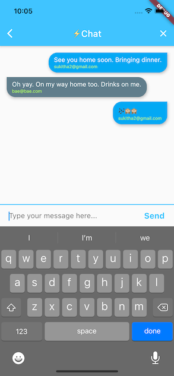

# Flutter Chat on Firebase

Project demonstrates building a simple chat application using **Flutter** framework and **Firebase** cloud. App does not poll for new messages, instead streams are used to make it reactive.

# Tech stack
- Firebase authentication for user management.
- Firebase Firestore message storage.

# Screenshots
      
